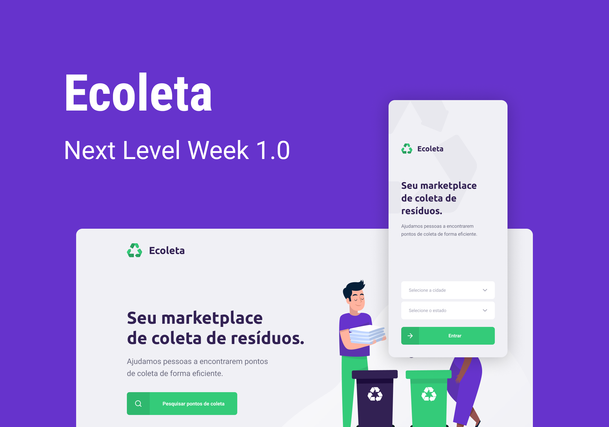

# Next Level Week - Ecoleta App

Ecoleta é uma aplicação com o intuito de facilitar a comunicação entre as empresas que fazem coleta de resíduos e as pessoas.
Facilita com que resíduos como lâmpadas, papéis, papelão, resíduos orgânicos, pilhas e baterias, entre outros, tenham o destino correto.

_Empresas_: faça o cadastro do estabelecimento de coleta, com informações de contato(e-mail e whatsapp), enedereço e items coletados.

_Usuários_: entre em contato com uma empresa que coleta o resíduo.

---

### Next Level Week

Uma semana de aprendizado fornecida pela Rocketseat, onde conceitos de backend, frontend e mobile foram abordados.

Construimos juntos uma aplicação do ínicio usando a stack Node, React e React Native. Para o banco de dados SQLite foi utilizado
